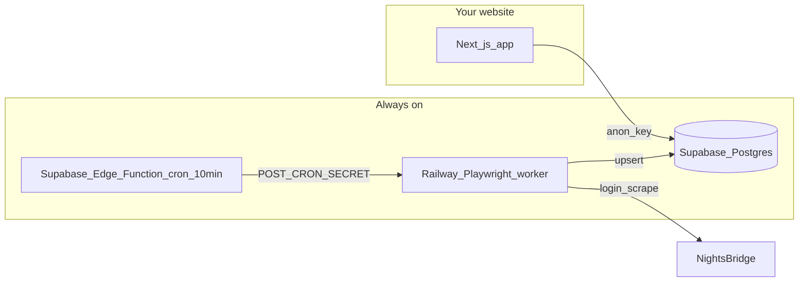

# Boga Legaba — Understanding the NightsBridge + Supabase Integration

A single reference for what we built, why, how it works, and what you still need to do.

---

## The big idea

**NightsBridge is only a data source.** Guests never use NB iframes on the main Stay flow. Data flows like this:

```
NightsBridge (owner login + API + webview)
        ↓  sync (Playwright, every ~10 min)
Supabase Postgres
        ↓  read via API
Your Next.js website (/stay, room cards, availability)
```

Your **deployed website** only talks to **Supabase**. It does not need your Mac once cloud sync is running.

---

## What problem we solved

| Before | After |
|--------|--------|
| Static room list in `data/rooms.ts` | Live inventory from Supabase (synced from NB) |
| NightsBridge embed on Stay | Custom React/Tailwind UI on `/stay` |
| No availability on site | Date search → `/api/availability` |
| Marketing copy mixed with real data | Stay shows synced fields only |
| No visibility into sync | `/admin/nightsbridge` audit dashboard |
| Images from Unsplash catalog only | Webview scrape → `media_asset.source_url` (URLs, not downloads) |

---

## Architecture (Option B — no Mac in production)



| Piece | What it does | Where it runs |
|-------|----------------|---------------|
| **Scraper** | Login, fetch calendar, save rooms/bookings/availability, scrape image URLs | Railway (or Mac for testing) |
| **Supabase DB** | Stores all synced data | Supabase cloud |
| **Edge Function** | Cron alarm — calls Railway every 10 min | Supabase cloud |
| **Next.js APIs** | Public read endpoints for the site | Your host (e.g. Vercel) |
| **Stay UI** | Room cards, date search, live badges | Browser |

**Important:** Supabase cannot run Playwright (no browser). Railway (~$5–10/mo) runs the scraper. Supabase stores data and triggers the schedule.

---

## Repo map (important folders)

| Path | Purpose |
|------|---------|
| [`public/ScriptTestBLGH/`](public/ScriptTestBLGH/) | **Main sync script** — login, NB API, Supabase write, webview images |
| [`services/sync-worker/`](services/sync-worker/) | **Railway Docker worker** — `POST /run` triggers full sync |
| [`supabase/schema.sql`](supabase/schema.sql) | Base database tables |
| [`supabase/migrations/002_nb_extended.sql`](supabase/migrations/002_nb_extended.sql) | `media_asset`, `nb_api_snapshot`, `calendar_event`, extra columns |
| [`app/api/rooms/route.ts`](app/api/rooms/route.ts) | Public room catalog from DB |
| [`app/api/availability/route.ts`](app/api/availability/route.ts) | Room-night availability + rates |
| [`app/api/media/route.ts`](app/api/media/route.ts) | Image URLs from `media_asset` |
| [`app/api/nightsbridge/audit/route.ts`](app/api/nightsbridge/audit/route.ts) | Full data audit JSON |
| [`app/(main)/stay/`](app/(main)/stay/) | Stay page — synced rooms + date search |
| [`app/(main)/admin/nightsbridge/`](app/(main)/admin/nightsbridge/) | Visual debug dashboard |
| [`lib/synced-rooms.ts`](lib/synced-rooms.ts) | Builds property groups from DB rows (no static fallback) |
| [`docs/COMPLETION_CHECKLIST.md`](docs/COMPLETION_CHECKLIST.md) | Step-by-step to finish Option B |
| [`docs/NIGHTSBRIDGE_DATA_FLOW.md`](docs/NIGHTSBRIDGE_DATA_FLOW.md) | Technical data flow |
| [`docs/DISABLE_MAC_SYNC.md`](docs/DISABLE_MAC_SYNC.md) | Turn off Mac cron after cloud works |

---

## What NightsBridge gives us (and what it doesn’t)

### Fetched via `BookingCalendarRQ` (bridgeitapi)

- Property: `bbid`, `bbname`
- Rooms: `bbroomid`, `roomname`, `bbrtid`, `orderby`
- Room types: name, description, occupancy, size, rate scheme (in `room_type.raw`)
- Bookings + guest stays (PII — service role only)
- Closeouts, calendar events (stored; closeouts not yet applied to availability)

### Not in the API

- **Room/property image URLs** → scraped from NB **Webview → Web Info** (`images.py`)
- Amenities list, live rate cards, booking widget deep links

### Enriched during sync (not raw NB)

`room_catalog.py` adds per room: `property_name`, `address`, `configuration`, `bathroom_type` (matched by room name).

---

## Database tables (Supabase)

| Table | Who reads it | Contents |
|-------|----------------|----------|
| `room` | Public (anon) | Room names, property, config, bath |
| `room_type` | Public | Descriptions, occupancy when `bbrtid` linked |
| `availability_cache` | Public | Per room-night: available?, rate, status |
| `media_asset` | Public | Image **URLs** (`source_url`), source `nightsbridge` |
| `sync_run` | Admin | Sync history (ok, counts, errors) |
| `nb_api_snapshot` | Admin | Payload shape audit per sync |
| `booking`, `guest` | Service role only | PII |

---

## Website API routes

| Route | Source |
|-------|--------|
| `GET /api/rooms` | Supabase `room` + `room_type` |
| `GET /api/availability?from=&to=` | Supabase `availability_cache` |
| `GET /api/media` | Supabase `media_asset` |
| `GET /api/nightsbridge/audit` | Full DB audit (needs `NB_AUDIT_KEY` or dev mode) |
| `POST /api/sync` | Proxies to Railway worker (needs `CRON_SECRET`) |

**The live site never calls NightsBridge directly at runtime.**

---

## Stay page (`/stay`) behaviour

1. Loads rooms from `/api/rooms` (Supabase only — no static catalog fallback).
2. Auto-searches default dates via `/api/availability`.
3. Hides rooms that are booked for the selected stay.
4. Shows green **Live · Supabase** badges on rooms, availability, rates, and NB-sourced photos.
5. Room images: `media_asset` URL first, then fallback `data/site-images.ts`.

---

## How to run sync manually

```bash
# Full sync (rooms + bookings + availability + webview image URLs)
cd public/ScriptTestBLGH && ./run-sync.sh

# Verify database tables exist
services/nightsbridge-sync/.venv/bin/python scripts/verify-supabase-schema.py
```

Requires in `.env.local`:

- `NEXT_PUBLIC_SUPABASE_URL`, `SUPABASE_SERVICE_ROLE_KEY`
- `SITE_USER`, `SITE_PASS` (NightsBridge login)

---

## Environment variables (`.env.local`)

| Variable | Used by |
|----------|---------|
| `NEXT_PUBLIC_SUPABASE_URL` | Website + scraper |
| `NEXT_PUBLIC_SUPABASE_ANON_KEY` | Website (public reads) |
| `SUPABASE_SERVICE_ROLE_KEY` | Scraper, audit API, admin routes |
| `SITE_USER` / `SITE_PASS` | NightsBridge login (scraper only) |
| `CRON_SECRET` | Railway worker + Edge Function auth |
| `NB_AUDIT_KEY` | Protects `/admin/nightsbridge` in production |

See [`.env.example`](.env.example) for a template.

---

## What you still need to do (Option B completion)

Your schema is verified (all tables including `media_asset` exist). Remaining steps:

### 1. Deploy Railway worker

- See [`services/sync-worker/README.md`](services/sync-worker/README.md)
- Dockerfile: `services/sync-worker/Dockerfile`
- Set env vars on Railway (same as scraper needs)
- Test: `curl -X POST https://YOUR-URL/run -H "Authorization: Bearer YOUR_CRON_SECRET"`

### 2. Supabase Edge Function + schedule

```bash
export SUPABASE_PROJECT_REF=your-project-ref
./scripts/deploy-edge-function.sh
```

Then in Supabase Dashboard:

- Secrets: `SYNC_WORKER_URL`, `CRON_SECRET`
- Schedule `trigger-nightsbridge-sync` every **10 minutes**

### 3. Disable Mac sync

After cloud sync works, follow [`docs/DISABLE_MAC_SYNC.md`](docs/DISABLE_MAC_SYNC.md).

### 4. Deploy website

Production needs Supabase keys + optional `NB_AUDIT_KEY`. No `RUN_LOCAL_SYNC` in production.

**Full checklist:** [`docs/COMPLETION_CHECKLIST.md`](docs/COMPLETION_CHECKLIST.md)

---

## Git / branch

- Work committed as **`scrap1`** on branch **`scrapping`**
- Plan file (do not edit): `.cursor/plans/nb_supabase_option_b_55e2830b.plan.md`

---

## Known gaps (not blockers for launch)

| Gap | Notes |
|-----|--------|
| Many rooms missing `bbrtid` | Descriptions/occupancy empty until fixed in NB dashboard |
| Closeouts not in availability calc | Booked logic uses bookings only |
| Webview image scrape can be brittle | Debug with `HEADLESS=false ./run-sync.sh` |
| NB iframes still on nav, book-now, hero | Architecture goal is custom UI only on Stay |
| `bookingnotificationsrq` not implemented | Future: cheaper polling between full syncs |

---

## Quick links when developing

| What | URL / command |
|------|----------------|
| Stay page | `http://localhost:3000/stay` |
| Audit dashboard | `http://localhost:3000/admin/nightsbridge` |
| Audit JSON | `http://localhost:3000/api/nightsbridge/audit` |
| Verify schema | `npm run sync:verify-schema` |
| Cron (server path) | `scripts/nightsbridge-sync-cron.sh` → uses `ScriptTestBLGH` |

---

## One-sentence summary

**We mirror NightsBridge into Supabase with a cloud worker, and the website reads that database to show real rooms, availability, rates, and image URLs — without embedding NightsBridge on Stay.**

---

*Last updated: June 2026 — Boga Legaba website integration*
